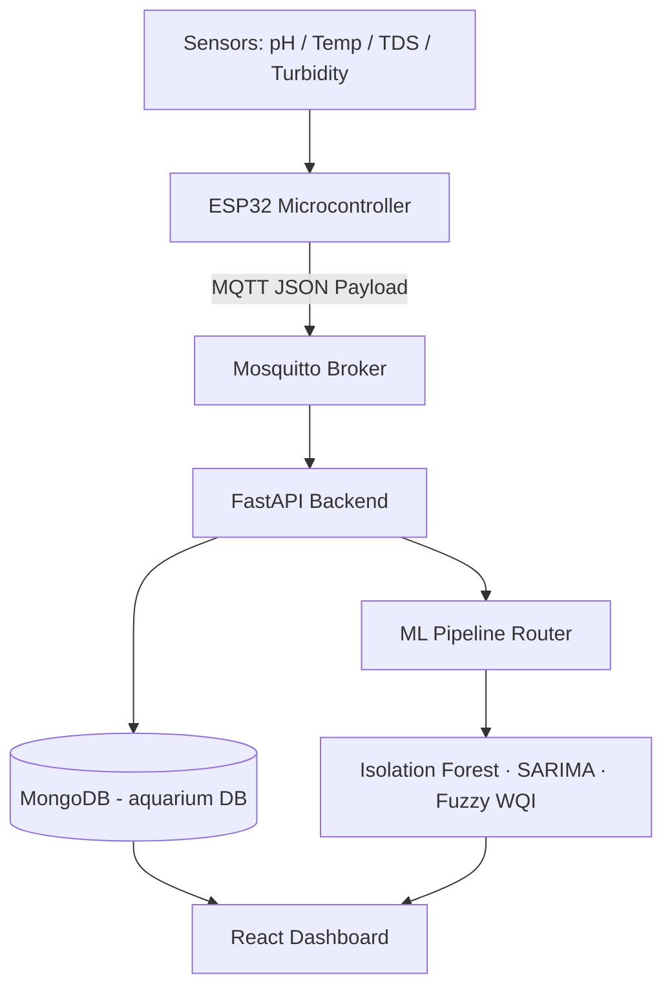

# Smart Aquarium Adaptive IoT Analytics Platform

An **adaptive AI-driven IoT monitoring and decision-support platform** that continuously tracks aquarium water conditions and generates intelligent maintenance recommendations using real-time sensor data, statistical monitoring, and machine learning.

This project demonstrates a **complete IoT data pipeline**, including embedded sensor integration, MQTT communication, FastAPI backend, MongoDB storage, ML analytics, and a React web dashboard for real-time monitoring.

---

## System Architecture



---

## Technology Stack

| Layer | Technology |
|---|---|
| IoT Device | ESP32 + pH / DS18B20 / TDS / Turbidity sensors |
| Messaging | MQTT (Eclipse Mosquitto) |
| Backend | FastAPI + Uvicorn (Python) |
| Database | MongoDB (Motor async driver) |
| ML / Analytics | scikit-learn, statsmodels, numpy, pandas |
| Frontend | React + TypeScript + Vite + Tailwind CSS |
| Charts | Recharts |

---

## Key Features

### 1. Water Quality Index (WQI)
Fuzzy weighted scoring with compound stress penalty and anomaly confidence weight.

```
WQI = (pH × 0.35) + (TDS × 0.35) + (Turbidity × 0.20) + (Temperature × 0.10)
    − anomaly_penalty (applied by Isolation Forest)
```

| WQI | Condition |
|---|---|
| 85–100 | Excellent |
| 70–84 | Good |
| 50–69 | Fair |
| 30–49 | Poor |
| < 30 | Critical |

### 2. Pipeline Router Modes

| Mode | Trigger |
|---|---|
| `COLD_START` | Tank age < 14 days — no anomaly detection |
| `ADAPTIVE` | Tank age ≥ 14 days — full ML pipeline active |
| `MAINTENANCE` | User toggled water change — WQI paused |
| `STABILIZING` | 10-minute cooldown after maintenance ends |
| `SENSOR_ERROR` | One or more sensors out of valid range |

### 3. SARIMA Forecasting
- pH: `SARIMA(1,1,0)(0,0,1,24)` — lower CI as pessimistic acid-crash risk bound
- Temperature: `SARIMA(1,0,1)(0,1,0,24)` — upper CI as overheating risk bound
- 24-hour ahead predictions cached per UTC hour

### 4. Anomaly Detection
Isolation Forest on 4-sensor feature vector. Consecutive anomaly docs (gap < 7.5 min) clustered into `AnomalyEvent` with `persistence` count.

### 5. Live MQTT → Dashboard Pipeline
ESP32 publishes → Mosquitto → FastAPI subscriber → ML pipeline → MongoDB → React auto-refresh every 30s.

---

## Project Structure

```
smart-aquarium-iot-analytics-platform/
├── backend/
│   ├── app/
│   │   ├── main.py              # FastAPI app + lifespan
│   │   ├── config.py            # Pydantic settings
│   │   ├── database.py          # Motor MongoDB helpers
│   │   ├── models.py            # Pydantic request/response schemas
│   │   ├── mqtt_client.py       # Paho MQTT subscriber
│   │   ├── dependencies.py      # FastAPI dependency injection
│   │   ├── routers/             # latest, status, telemetry, forecast, history, maintenance
│   │   └── services/            # pipeline_service, forecast_cache
│   ├── seed_demo_data.py        # Populate 7 days of history from CSV
│   ├── replay_sensor.py         # Simulate ESP32 via MQTT (demo)
│   └── requirements.txt
├── frontend/
│   └── src/app/
│       ├── pages/
│       │   ├── simple/          # Overview, Status, History
│       │   └── advanced/        # Overview, SensorAnalytics, Forecast, WQIBreakdown, AnomalyDetection, FishHealth
│       ├── hooks/               # useLatest, useStatus, useHistory, useForecast, useAnomalies, useMaintenance
│       ├── api/                 # client.ts, types.ts
│       └── components/          # WQIGauge, KPICard, layouts, UI
├── notebooks/
│   ├── 01_eda.ipynb
│   ├── 02_preprocessing.ipynb
│   ├── 03_anomaly_detector.ipynb
│   └── 04_adaptive_wqi.ipynb
├── src/
│   ├── pipeline_router.py       # AquariumPipelineRouter — single ML entry point
│   └── forecasting_pipeline.py  # SARIMAForecaster
└── data/
    └── smart_aquarium_dataset_v6.1.csv
```

---

## API Endpoints

| Method | Endpoint | Description |
|---|---|---|
| GET | `/api/latest` | Most recent sensor reading + WQI |
| GET | `/api/status` | System mode, install date, days until adaptive |
| GET | `/api/history?days=7` | Historical telemetry records |
| GET | `/api/forecast` | 24h SARIMA pH + temperature forecast |
| GET | `/api/anomalies?limit=50` | Clustered anomaly events |
| POST | `/api/telemetry` | Ingest reading via HTTP (same path as MQTT) |
| POST | `/api/maintenance/start` | Activate maintenance mode |
| POST | `/api/maintenance/stop` | Deactivate + start 10-min stabilising cooldown |

---

## Running Locally

### Prerequisites
- Docker Desktop (MongoDB + Mosquitto)
- Python 3.10+ with pip
- Node.js 18+

### Steps

**1. Start Docker services**
```bash
docker start mongo mosquitto
```

**2. Install backend dependencies**
```bash
pip install -r backend/requirements.txt
```

**3. Start the backend**
```bash
cd backend
uvicorn app.main:app --reload --host 0.0.0.0 --port 8000
```

**4. Start the frontend**
```bash
cd frontend
npm install
npm run dev
```

**5. Seed demo data**
```bash
python backend/seed_demo_data.py
```

**6. Run live sensor replay (optional)**
```bash
python backend/replay_sensor.py --rows 100 --speed 60
```

**7. Open the app**
- Simple mode: `http://localhost:5173/simple`
- Advanced mode: `http://localhost:5173/advanced/overview`
- API docs: `http://localhost:8000/docs`

---

## Environment Variables

Copy `backend/.env.example` to `backend/.env` and configure:

```env
MONGODB_URL=mongodb://localhost:27017
MONGODB_DB=aquarium
MQTT_BROKER=localhost
MQTT_PORT=1883
MQTT_TOPIC=aquarium/telemetry
INSTALL_DATE=2026-01-01
CORS_ORIGINS=["http://localhost:5173"]
```

---

## MQTT Payload Format

The ESP32 (or replay script) publishes to `aquarium/telemetry`:

```json
{
  "ph": 7.2,
  "temperature": 26.1,
  "tds": 285,
  "turbidity": 3.4
}
```

---

## Authors

**M.Y.K. Kularathne**
**H.M.N.S. Premachandra**
**H.M.T.W. Dilshan**
**H.M.D.C. Hennayake**

IoT & Data Analytics Evaluation Project — 2026
