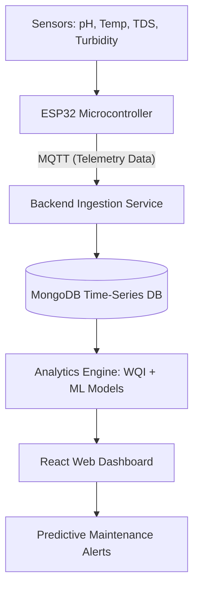

# Smart Aquarium IoT Analytics Platform

An **end-to-end IoT monitoring and analytics platform** that continuously tracks aquarium water conditions and generates intelligent maintenance recommendations using real-time sensor data and machine learning.

This project demonstrates a **complete IoT data pipeline**, including embedded sensor integration, MQTT communication, backend data ingestion, NoSQL storage, machine learning analytics, and a web-based dashboard for real-time monitoring.

---

## 📋 Overview

Maintaining stable water quality is critical for aquarium ecosystems. Manual monitoring is inconsistent and often fails to detect gradual changes that can stress or harm fish.

This system automates the monitoring process by:

- **Continuously collecting** water quality data.
- **Analyzing sensor patterns** using machine learning.
- **Forecasting potential issues** before they occur.
- **Providing clear recommendations** via an intuitive dashboard.

The platform converts multiple sensor readings into a **Water Quality Index (WQI)** and combines it with anomaly detection and forecasting models to determine overall aquarium health.

---

## 🏗️ System Architecture

The platform follows a layered IoT architecture designed for modularity, scalability, and reliability.



---

## 🛠️ Technology Stack

### Hardware
- **ESP32 Microcontroller**: Central processing unit with integrated Wi-Fi.
- **Sensors**: pH, DS18B20 Temperature, TDS (Total Dissolved Solids), and Turbidity.

### Backend & Communication
- **MQTT Protocol**: Lightweight messaging for real-time telemetry.
- **Node.js / Python**: Scalable backend services and RESTful APIs.
- **MongoDB**: NoSQL database optimized for time-series sensor data.

### Machine Learning & Analytics
- **Isolation Forest**: Used for robust anomaly detection (identifying equipment failure or contamination).
- **ARIMA**: Time-series forecasting for predicting future water quality trends.
- **WQI Algorithm**: Weighted formula for real-time health scoring.

### Frontend
- **React.js**: Modern UI for real-time data visualization.
- **Chart.js**: Interactive historical trend analysis.

---

## 🚀 Key Features

### 1. Water Quality Index (WQI)

Multiple parameters are synthesized into a single health score using weighted averages.

```
WQI = (0.35 × pH) + (0.35 × TDS) + (0.20 × Turbidity) + (0.10 × Temp)
```

| WQI Range | Condition | Action Required |
|----------|----------|----------------|
| 80–100 | Stable | None |
| 60–80 | Monitor | Observe trends |
| 40–60 | Warning | Maintenance recommended soon |
| 20–40 | Action | Maintenance required immediately |
| <20 | Critical | Emergency intervention |

---

### 2. Intelligent Anomaly Detection

The **Isolation Forest model** automatically flags outliers caused by:

- Filter failures  
- Sudden chemical spikes  
- Sensor malfunctions  
- Contamination events  

without requiring manual thresholds.

---

### 3. Predictive Forecasting

The **ARIMA model** analyzes historical data to predict where water quality will be in the next **24 hours**, allowing proactive rather than reactive maintenance.

---

### 4. Alert Persistence Logic

To eliminate **sensor noise and false alarms**, the system only triggers alerts after **five consecutive degraded readings**.

---

## 📂 Project Structure

```
smart-aquarium-iot-analytics-platform
├── firmware/     # ESP32 C++ / Arduino sensor code
├── backend/      # MQTT subscriber and API services
├── analytics/    # WQI logic, Isolation Forest, and ARIMA models
├── database/     # MongoDB schema and connection logic
├── dashboard/    # React frontend application
└── docs/         # Architecture diagrams and technical specs
```

---

## 📋 Example Telemetry

```json
{
  "timestamp": "2026-02-10T10:15:00Z",
  "temperature": 25.3,
  "ph": 6.8,
  "tds": 120,
  "turbidity": 2.3,
  "status": "NORMAL"
}
```

---

## ✍️ Authors

- **M.Y.K. Kularathne**  
- **H.M.N.S. Premachandra**  
- **H.M.T.W. Dilshan**  
- **H.M.D.C. Hennayake**

**IoT & Data Analytics Evaluation Project — March 2026**
