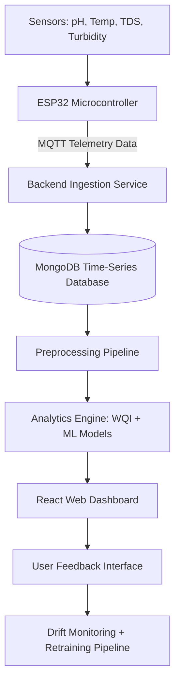

# Smart Aquarium Adaptive IoT Analytics Platform

An **adaptive AI-driven IoT monitoring and decision-support platform** that continuously tracks aquarium water conditions and generates intelligent maintenance recommendations using real-time sensor data, statistical monitoring, and machine learning.

This project demonstrates a **complete IoT data pipeline**, including embedded sensor integration, MQTT communication, backend data ingestion, NoSQL storage, preprocessing pipelines, machine learning analytics, and a web-based dashboard for real-time monitoring.

The system evolves over time using **human-in-the-loop feedback, concept drift monitoring, and batch recalibration**, allowing the analytics models to adapt to the specific behavior of a real aquarium.

---

## 📋 Overview

Maintaining stable water quality is critical for aquarium ecosystems. Manual monitoring is inconsistent and often fails to detect gradual environmental changes that can stress or harm fish.

This system automates monitoring and provides **intelligent decision support** by:

- **Continuously collecting** water quality telemetry from IoT sensors.
- **Cleaning and preprocessing** noisy sensor data streams.
- **Computing a Water Quality Index (WQI)** for simplified health monitoring.
- **Detecting anomalies** using machine learning.
- **Forecasting potential issues** before they occur.
- **Providing actionable maintenance recommendations** through a dashboard.

The platform converts multiple sensor readings into a **single interpretable health score** and combines this with anomaly detection and forecasting models to determine overall aquarium stability.

---

## 🏗️ System Architecture

The platform follows a **layered IoT + AI architecture** designed for modularity, scalability, and reliability.



---

## 🛠️ Technology Stack

### Hardware

- **ESP32 Microcontroller** – Wi-Fi enabled microcontroller for sensor integration
- **Sensors**
  - pH Sensor
  - DS18B20 Temperature Sensor
  - TDS Sensor
  - Turbidity Sensor

### Backend & Communication

- **MQTT Protocol** – lightweight real-time messaging
- **Node.js / Python** – backend processing services
- **REST APIs** – communication between backend and dashboard

### Database

- **MongoDB** – NoSQL time-series database optimized for sensor telemetry

### Machine Learning & Analytics

- **Isolation Forest** – anomaly detection for multi-sensor data
- **ARIMA** – time-series forecasting for water quality trends
- **WQI Algorithm** – weighted scoring model for water health
- **Adaptive Baseline Monitoring** – statistical detection of environmental drift

### Frontend

- **React.js** – web dashboard
- **Chart.js** – real-time data visualization

---

## 🚀 Key Features

### 1. Water Quality Index (WQI)

Multiple water parameters are combined into a single health score using weighted averages.

```
WQI = (0.35 × pH) + (0.35 × TDS) + (0.20 × Turbidity) + (0.10 × Temperature)
```

| WQI Range | Condition | Action Required |
|----------|----------|----------------|
| 80–100 | Stable | No action required |
| 60–80 | Monitor | Observe trends |
| 40–60 | Warning | Maintenance recommended soon |
| 20–40 | Action Required | Immediate maintenance |
| <20 | Critical | Emergency intervention |

---

### 2. Intelligent Anomaly Detection

The **Isolation Forest model** identifies abnormal multi-sensor patterns that may indicate:

- filter clogging
- contamination events
- chemical instability
- sensor malfunction

Because it does not require labeled data, it is well suited for **IoT anomaly detection**.

---

### 3. Predictive Forecasting

The **ARIMA time-series model** predicts short-term water quality trends, allowing proactive maintenance actions before conditions become critical.

Example predicted trends include:

- rising turbidity levels
- declining WQI stability
- temperature drift

---

### 4. Alert Persistence Logic

To reduce false alarms caused by sensor noise, alerts are only triggered when:

```
Five consecutive degraded readings occur
```

This persistence logic significantly reduces **alarm fatigue**.

---

### 5. Adaptive Learning Loop

The system improves over time using a **Human-in-the-Loop (HITL) feedback mechanism**.

Workflow:

1. Model detects a potential anomaly
2. Dashboard displays alert
3. User confirms or rejects the alert
4. Verified feedback becomes labeled training data
5. Drift monitoring evaluates model performance
6. Batch recalibration updates the model

This allows the system to evolve from a **generic synthetic-data model into a tank-specific intelligence system**.

---

## 📂 Project Structure

```
smart-aquarium-iot-analytics-platform
├── firmware/      # ESP32 sensor firmware
├── backend/       # MQTT subscriber and API services
├── analytics/     # WQI logic, preprocessing, ML models
├── database/      # MongoDB schema and configuration
├── dashboard/     # React frontend application
└── docs/          # Architecture diagrams and technical documentation
```

---

## 📋 Example Telemetry

```json
{
  "timestamp": "2026-02-10T10:15:00Z",
  "temperature": 25.3,
  "ph": 6.8,
  "tds": 120,
  "turbidity": 2.3,
  "wqi": 84,
  "status": "STABLE"
}
```

---

## 🔬 Data Processing Pipeline

IoT sensor data contains noise, spikes, and missing values. A preprocessing pipeline prepares the data for analytics.

Pipeline steps:

```
Raw Sensor Data
      ↓
Missing Value Handling (Forward Fill)
      ↓
Spike Removal (Median Filter)
      ↓
Sensor Sanity Checks
      ↓
Feature Engineering
      ↓
Machine Learning Models
```

Engineered features include:

- rolling mean
- rolling variance
- rate of change (ROC)
- stability indicators

These features allow the system to detect **early signs of environmental instability**.

---

## 🔮 Future Improvements

- automated water-change system
- mobile monitoring application
- cloud deployment for multi-tank monitoring
- deep learning forecasting models
- automated dosing and filtration control

---

## ✍️ Authors

**M.Y.K. Kularathne**  
**H.M.N.S. Premachandra**  
**H.M.T.W. Dilshan**  
**H.M.D.C. Hennayake**

**IoT & Data Analytics Evaluation Project — 2026**
